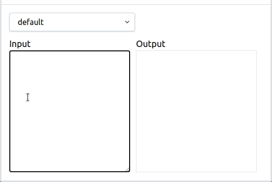

# Introduction
This is an example of using [Markdom](https://github.com/sinnbeck/markdom) with [Livewire](https://laravel-livewire.com/)



## Getting started
Simple clone this repo and start a development server
```
//Go the folder where you have your projects
git clone git@github.com:sinnbeck/markdom-livewire.git

// go to the new application folder
cd markdom-livewire

// install your composer packages
composer install

// create .env file
cp .env.example .env

// generate application key
php artisan key:generate

// start the serve
php artisan serve


//Open provided url
```
There is an example of markdown for testing in the project root named `example.md`
